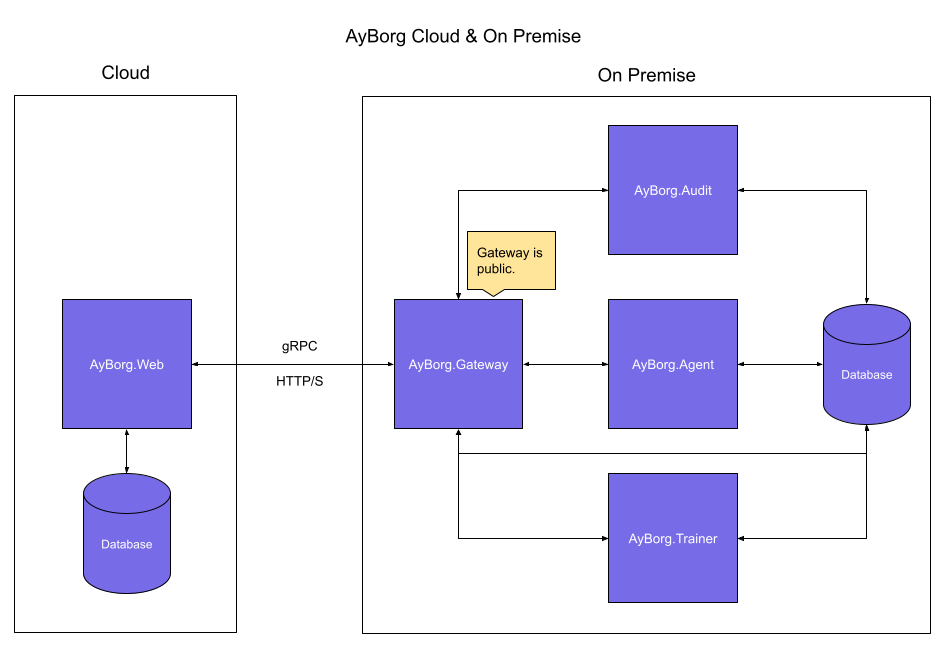
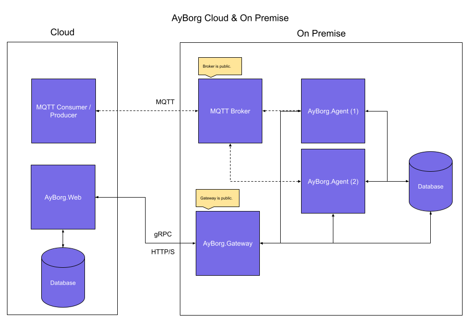

# AyBorg

## Why AyBorg?

- **Easy to use!**
  - Don't spend a lot of time to write code, just use instead AyBorg's user **friendly no code** interface!
  - If you ever need to write code, still don't spend to much time on it, with AyBorg's very simple plugin interface!
- **One interface to fit them all!** Don't invest a lot of money to train your employees in different applications!
- **Scalable!** No matter how many devices are connected, AyBorg can handle them all in one interface!
- **Easy to integrate into your existing infrastructure**, thanks to MQTT!
- **No vendor lock-in!**
  - Run it on Azure, AWS, or on premise.
  - No specific library to use! Your processing library? No Problem, use it!
- **Data secure!** Keep the data on your edge device or send it to the cloud. Your solution, your choice!
- **Open for extensions!**
  - You need a new fancy plugin? Go for it, AyBorg is open to be extented.
  - AyBorg is not only easy to use, it is also easy to extend! (See [StepBody](doc/agent/plugins/custom-plugins.md#stepBody))
  - You write your logic, AyBorg does the rest!

### Steps

Steps are called the plugins, provding methods executed in the runtime flow:

## Getting started

Because AyBorg is orchastrated into multipe microservices, you need to start each service separately.
In most cases the following setup makes sense:

1. A MQTT broker (e.g. [Eclipse-Mosquitto](https://mosquitto.org))
2. AyBorg.Gateway
3. AyBorg.Web
4. One or more [AyBorg.Agent(s)](doc/agent/agent.md)

The default appsettings give you a good starting point and will also work locally, but for real scenarios, you will need to change the settings.

> AyBorg default user "**SystemAdmin**" with password "**SystemAdmin123!**".

> :warning: **The default password should be changed immediately!**

## Default Ports

| Service          | HTTP | HTTPS | gRPC |
| ---------------- | ---- | ----- | ---- |
| AyBorg.Gateway   |      |       | 5000 |
| AyBorg.Analytics |      |       | 5001 |
| AyBorg.Web       | 5010 | 5011  |      |
| AyBorg.Agent     |      |       | 5020 |

## Example setups

Services can be added any time. The AyBorg.Gateway will detect the new service and establish the communication.

### Using AyBorg.Agent as MQTT Consumer/Producer

Typically, you will send the processed results to an MQTT broker so that other services (e.g. another AyBorg.Agent) can further process the data.

## Want to contribute?

We are happy to accept contributions from the community. Please read our [contributing guidelines](CONTRIBUTING.md) for more information.
