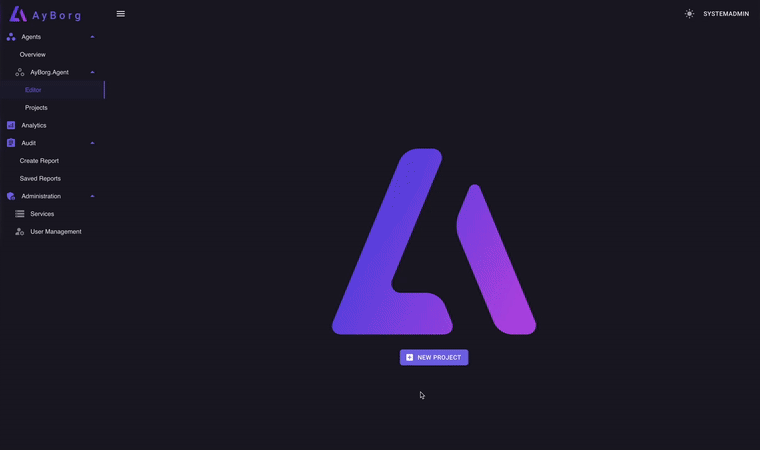
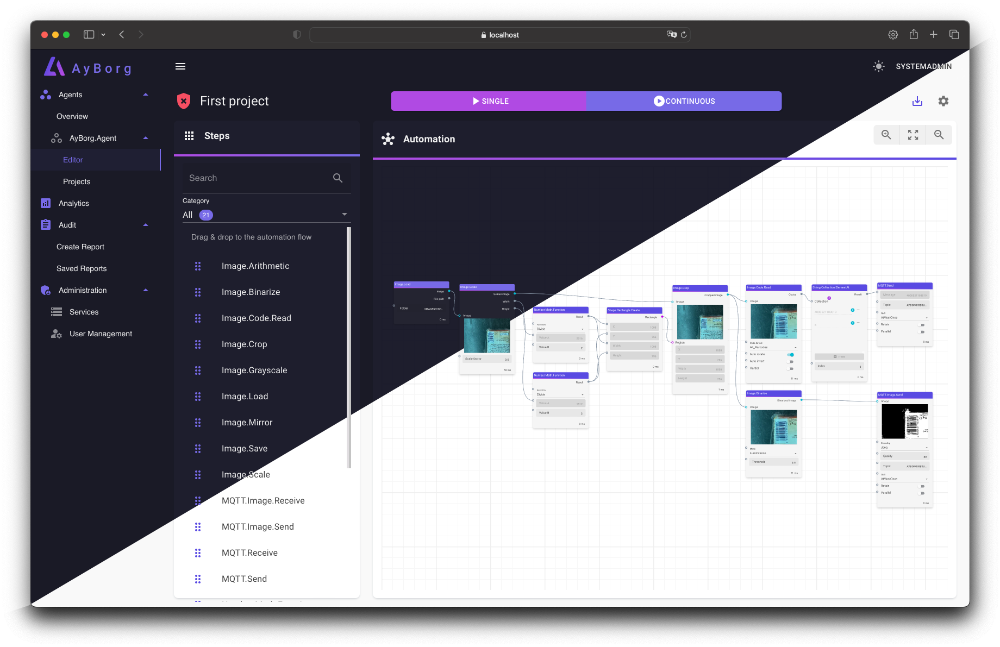
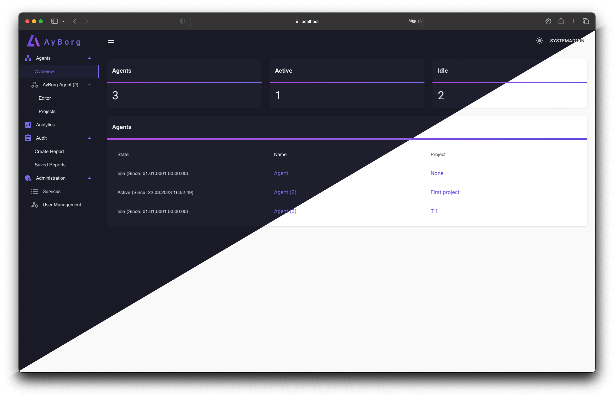
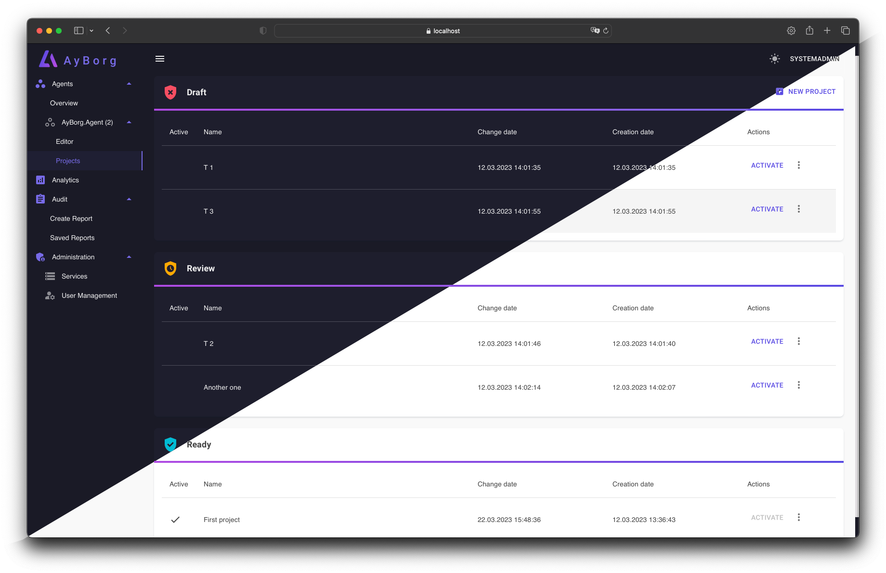
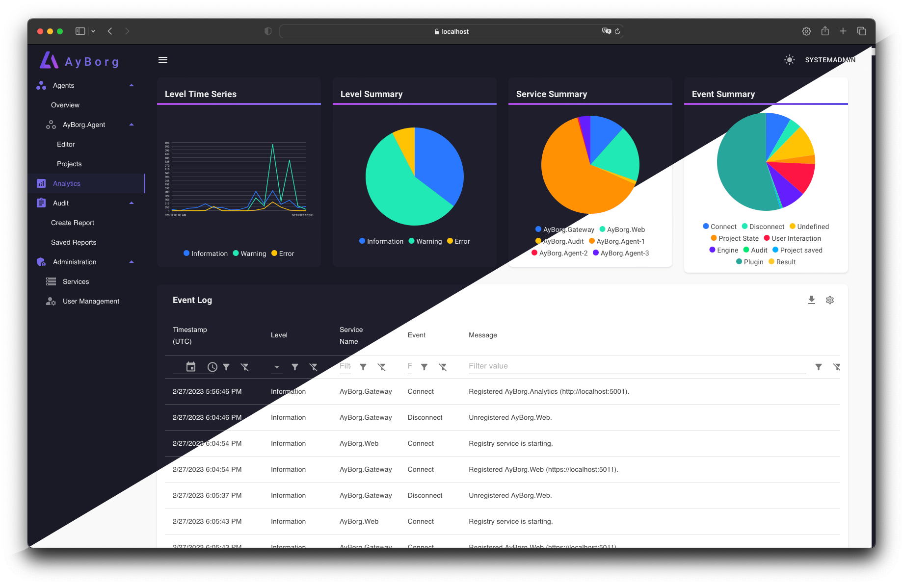
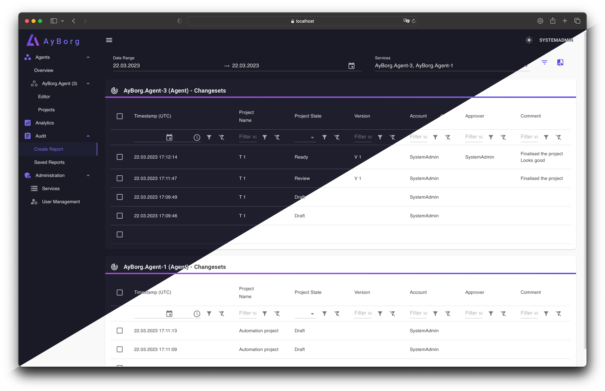
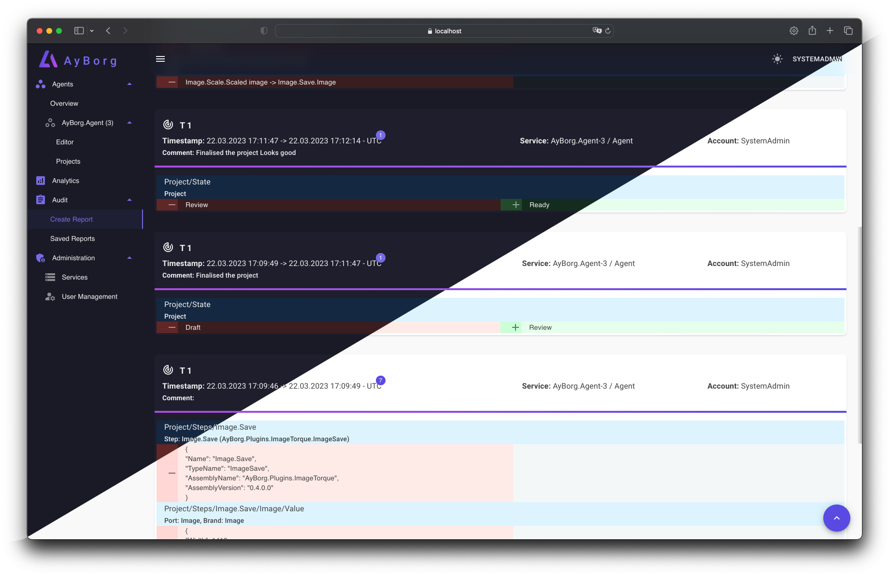
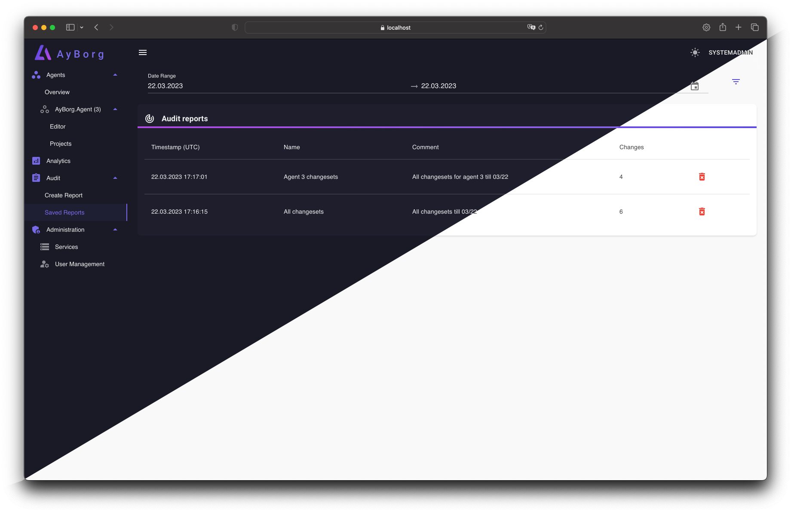
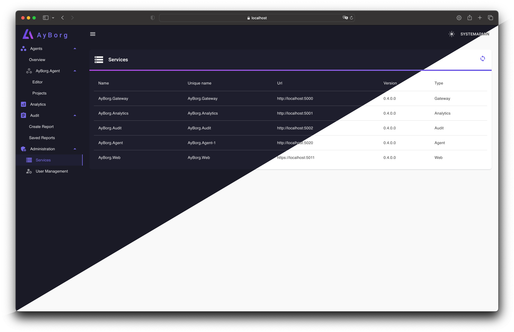
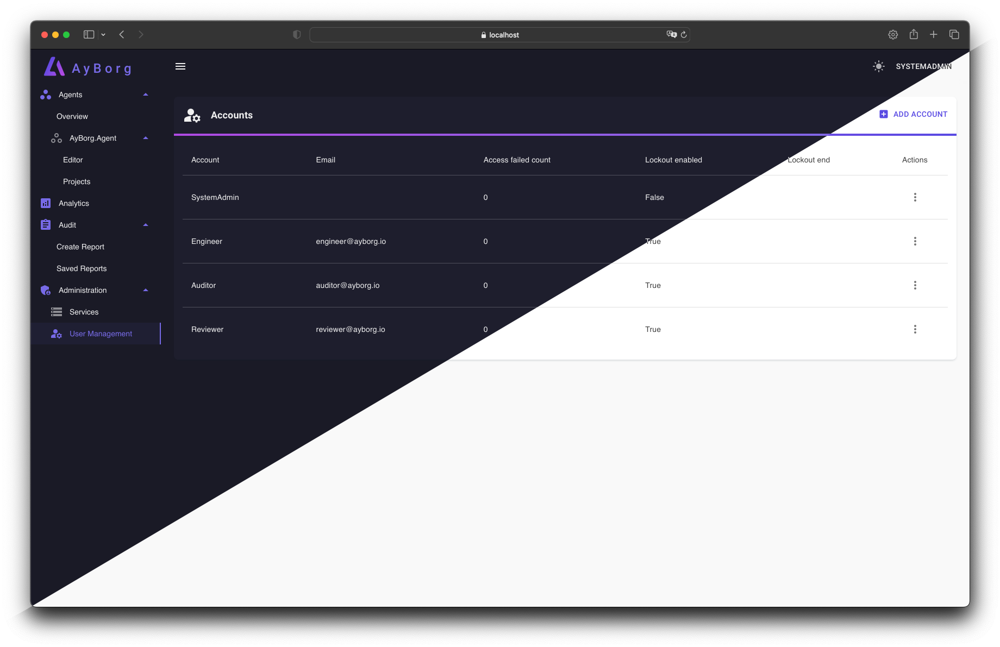

# AyBorg

:star:  We appreciate your star, it helps!

With AyBorg you have the power to build and customise your own automation applications without writing a single line of code. Just drag and drop elements, connect the ports and voila!

Our platform focuses on computer vision, making it easier for you to keep an eye on your automation process.

We offer seamless integration with third-party plug-ins, so you can add custom functionality.

With our built-in auditing functionality, you'll have more control over your processes and data, leading to improved efficiency.

**:bangbang: AyBorg is still in its early stages of development and our API is still fluid and may change. If you happen to come across any bugs, please don't hesitate to report them - we'd be grateful for your help!**

## Agents

AyBorg's **Agents** are specially designed services for automating processes. Using the **AyBorg.Gateway**, they can communicate with other areas of the application. These powerful tools are ideal for optimizing your workflow and can help increase your efficiency.

### Editor

Our editor makes it a breeze to program your own workflows using simple drag and drop of steps/plugins into the data flow.

### Work with multiple agents

Work with as many agents as you want and distribute them across different systems. Thanks to seamless communication via the MQTT protocol, your creativity knows no bounds. Whether it's simple or complex scenarios, our agents enable you to perfectly realize your ideas!

### Project overview

The project overview lays out all the projects and their current status. That way, you can see which projects have been given the green light for production.

## Analytics

Get an overview of all events at a glance, whether it's user interaction, system event, or exception. It is important that you can understand and control your system at all times.

## Audit

In industries such as **medicine**, **pharmaceuticals**, and **food**, it is becoming increasingly important to conduct automated processes in an auditable system. Such a system is particularly essential in highly regulated areas such as **[FDA 21 CFR Part 11](https://www.accessdata.fda.gov/scripts/cdrh/cfdocs/cfcfr/cfrsearch.cfm)**. AyBorg has focused on ensuring high auditability and can therefore be used in these areas as well.

### Create new audit report

### Audit changes (diff)

### Save your reports

AyBorg provides the ability to store and access **audit reports** at any time. By storing these reports, administrators and auditors can review past events and ensure that the system has been functioning properly.

The ability to store and access audit reports offers a valuable way to monitor the system and **ensure compliance with requirements and standards**. Additionally, this can aid in troubleshooting by making it easier to identify the exact timing and cause of a problem.

## Administration

### Service overview

### Usermanagement

AyBorg has a **role-based user management system** that allows for precise control and management of access rights and functionalities within the application. With this approach, users can be organized into different roles, each with distinct permissions and access rights to various areas of the application.

## Getting started

### Git clone

`git clone https://github.com/Source-Alchemists/AyBorg.git --recursive` \
`cd AyBorg`

### Docker compose

We provide a ready to use Docker compose setup.

Just run `docker compose up` from the repository root directory. \
You can then open AyBorg at `https://localhost:6011`.

### (Optional) Manually

Because AyBorg is orchastrated into multipe services, you need to start each service separately.
In most cases the following setup makes sense:

1. A MQTT broker (e.g. [Eclipse-Mosquitto](https://mosquitto.org))
2. AyBorg.Gateway
3. AyBorg.Log
4. AyBorg.Audit
5. AyBorg.Web
6. One or more [AyBorg.Agent(s)](docs/agent/agent.md)

### Default credentials

The default appsettings give you a good starting point and will also work locally, but for real scenarios, you will need to change the settings.

> AyBorg default user "**SystemAdmin**" with password "**SystemAdmin123!**". \
> :warning: **The default password should be changed immediately!**

### Default Ports

| Service          | HTTP | HTTPS | gRPC |
| ---------------- | ---- | ----- | ---- |
| AyBorg.Gateway   |      |       | 6000 |
| AyBorg.Log |      |       | 6001 |
| AyBorg.Audit     |      |       | 6002 |
| AyBorg.Web       | 6010 | 6011  |      |
| AyBorg.Agent     |      |       | 6020 |

## Want to contribute?

We are happy to accept contributions from the community. Please read our [contributing guidelines](CONTRIBUTING.md) for more information.
