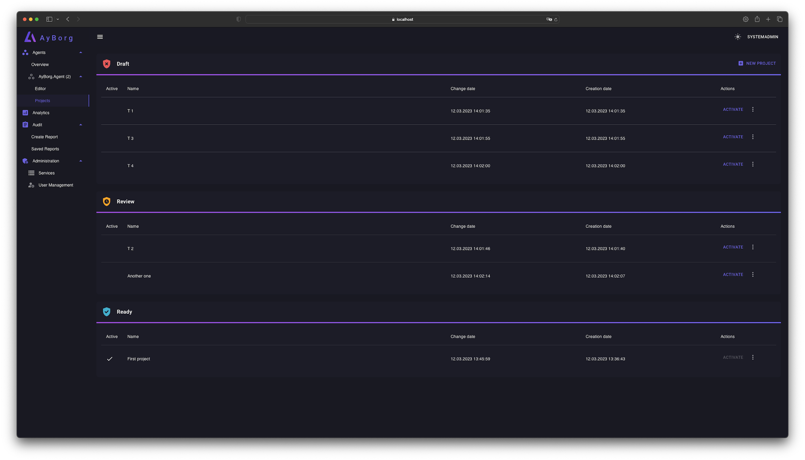
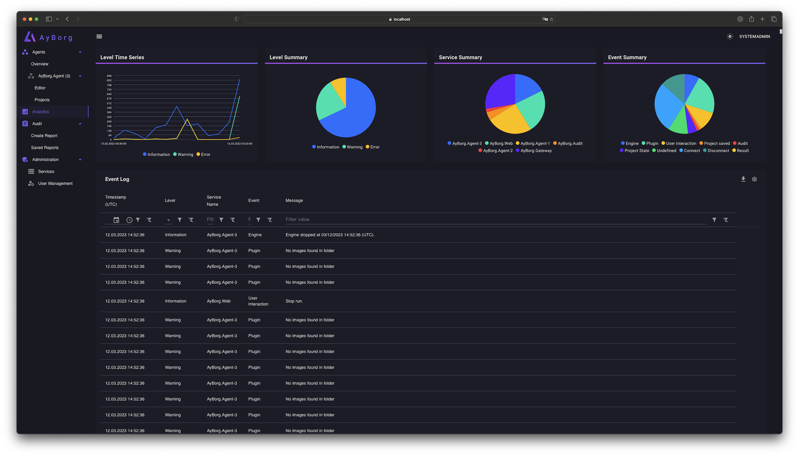
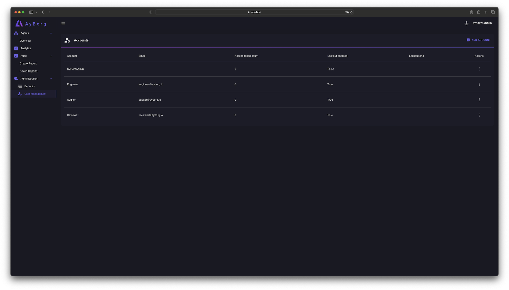

# AyBorg

 

:star:  We appreciate your star, it helps!

Hey there! Are you tired of complex and expensive Industrial IoT solutions that only add to your headaches? Introducing AyBorg, the powerful and scalable no-code/low-code platform for your production processes.

Our platform is free, open-source and provides a service-oriented architecture that can be easily adapted to your needs. With AyBorg, you'll have the power to build and customize your own industrial applications without needing to write a single line of code. Simply drag and drop elements, connect the ports and voila! You've got a fully functioning application that can be easily scaled and customized as your business grows.

We've got your back when it comes to monitoring your production goods too. Our platform has a focus on using camera systems for image processing, making it easier for you to keep an eye on your production. And if you need to add some extra features, our platform can be easily extended with plugins.

With AyBorg, you don't have to worry about being locked into one vendor. Our platform is open-source, meaning you have the freedom to adapt and modify it as you see fit. And because it's free, you'll be saving money compared to closed source solutions. Plus, with our built-in auditing functionality, you'll have even more control over your processes and data, leading to improved efficiency and cost savings.

So what are you waiting for? Say goodbye to complex and expensive solutions, and hello to the power of AyBorg. Get started today!

## Agents

### Editor

### Work with multiple agents

### Project overview

## Analytics

## Audit

### Create new audit report

### Audit changes (diff)

### Save your reports

## Administration

### Service overview

### Usermanagement

## Getting started

Because AyBorg is orchastrated into multipe microservices, you need to start each service separately.
In most cases the following setup makes sense:

1. A MQTT broker (e.g. [Eclipse-Mosquitto](https://mosquitto.org))
2. AyBorg.Gateway
3. AyBorg.Web
4. One or more [AyBorg.Agent(s)](doc/agent/agent.md)

The default appsettings give you a good starting point and will also work locally, but for real scenarios, you will need to change the settings.

> AyBorg default user "**SystemAdmin**" with password "**SystemAdmin123!**".

> :warning: **The default password should be changed immediately!**

## Default Ports

| Service          | HTTP | HTTPS | gRPC |
| ---------------- | ---- | ----- | ---- |
| AyBorg.Gateway   |      |       | 5000 |
| AyBorg.Analytics |      |       | 5001 |
| AyBorg.Audit     |      |       | 5002 |
| AyBorg.Web       | 5010 | 5011  |      |
| AyBorg.Agent     |      |       | 5020 |

## Example setups

Services can be added any time. The AyBorg.Gateway will detect the new service and establish the communication.

### Using AyBorg.Agent as MQTT Consumer/Producer

Typically, you will send the processed results to an MQTT broker so that other services (e.g. another AyBorg.Agent) can further process the data.

## Want to contribute?

We are happy to accept contributions from the community. Please read our [contributing guidelines](CONTRIBUTING.md) for more information.
