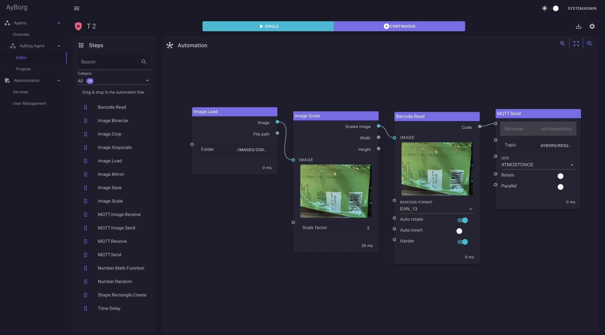

# Atomy
Atomy stays for **A**u**to**mation **m**ade eas**y**!

## Why Atomy?
- **Easy to use!** 
    - Atomy wants you to be successful with your automation solution, fast and easy!
    - Don't spend a lot of time to write code, just use Atomy's user **friendly no code** interface!
    - If you ever need to write code, still don't spend to much time on it, with Atomy's very simple plugin interface!
- **One interface to fit them all!** Don't invest a lot of money to train your employees in different applications, use Atomy instead!
- **Scalable!** No matter how many devices are connected, Atomy can handle them all in one interface!
- **Easy to integrate into your existing infrastructure**, thanks to MQTT!
- **No vendor lock-in!** 
    - Run it on Azure, AWS, or on premise.
    - No specific library to use! Your processing library? No Problem, use it!
- **Data secure!** Keep the data on your edge device or send it to the cloud. Your solution, your choice!
- **Open for extensions!**
    - You need a new fancy plugin? Go for it, Atomy is open to be extented.
    - Atomy is not only easy to use, it is also easy to extend! (See [StepBody](doc/agent/plugins/custom-plugins.md#stepBody))
    - You write your logic, Atomy does the rest!

## Transfer protocols
### MQTT

With MQTT, it should be easy to integrate into your existing ecosystem.

We also provide you with a ready to use Docker compose setup, including Mosquitto as MQTT broker.

### REST/HTTP
Every aspect of the software can be controlled by a REST API.

## Database
We support following databases:
 - SqlLite
 - PostgreSql

The ready to use Docker composition is targeting PostgreSql but can easily modified to target other database providers.

### Steps
Steps are called the plugins, provding methods executed in the runtime flow:

## Getting started
Because Atomy is orchastrated into multipe microservices, you need to start each service separately.
The services will also work without each other, but in most cases the following setup makes sense:

1. A MQTT broker (e.g. [Eclipse-Mosquitto](https://mosquitto.org))
2. Atomy.Registry
3. Atomy.Web
4. One or more [Atomy.Agent(s)](doc/agent/agent.md)

The default appsettings give you a good starting point and will also work locally, but for real scenarios, you will need to change the settings.

> Atomy default user "**SystemAdmin**" with password "**SystemAdmin123!**".

> :warning: **The default password should be changed immediately!**