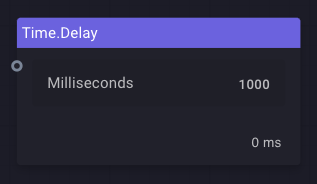

# Custom steps (plugins)

## StepBody
The step body is all what a developer need to write to have a fully executable plugin/step.
```c#
public sealed class TimeDelay : IStepBody
{
    private readonly NumericPort _milliseconds = new("Milliseconds", PortDirection.Input, 1000, 0);

    /// Display name for the step.
    public string DefaultName => "Time.Delay";

    public TimeDelay()
    {
        Ports = new List<IPort> { _milliseconds };
    }
    
    /// Ports provided.
    public IEnumerable<IPort> Ports { get; }

    /// The method that runs the step.
    public async Task<bool> TryRunAsync(CancellationToken cancellationToken)
    {
        try
        {
            var targetDelay = System.Convert.ToInt32(_milliseconds.Value);
            await Task.Delay(targetDelay, cancellationToken);
        }
        catch (TaskCanceledException)
        {
            return false;
        }

        return true;
    }
}
```
The resulting step would look like this:



## Ports
Go to [ports](../../ports.md).