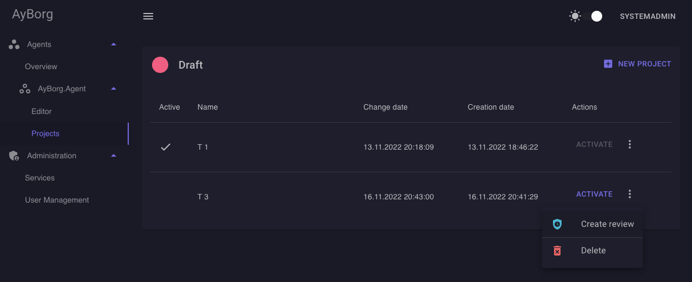
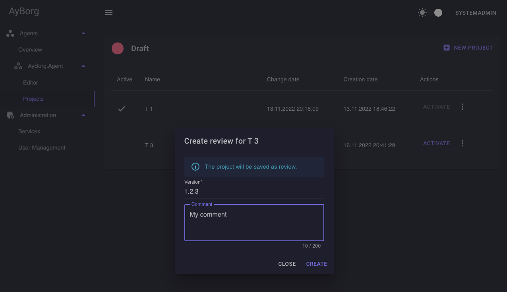
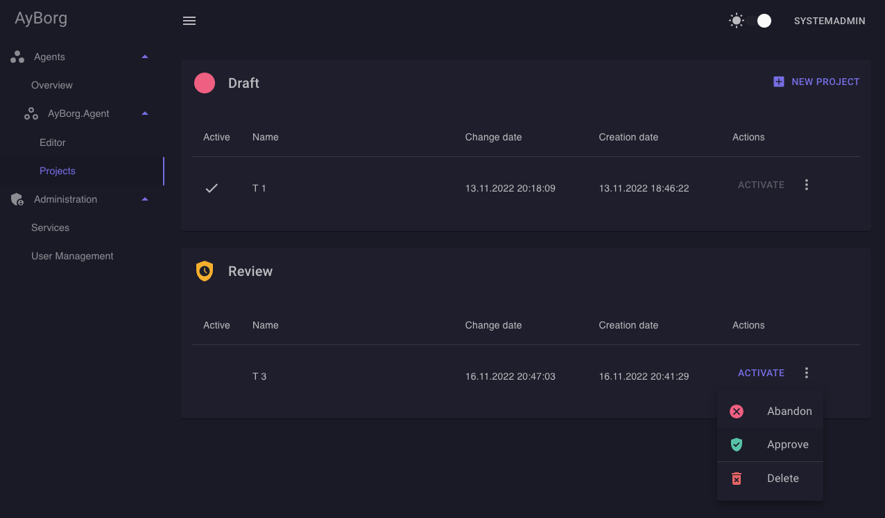
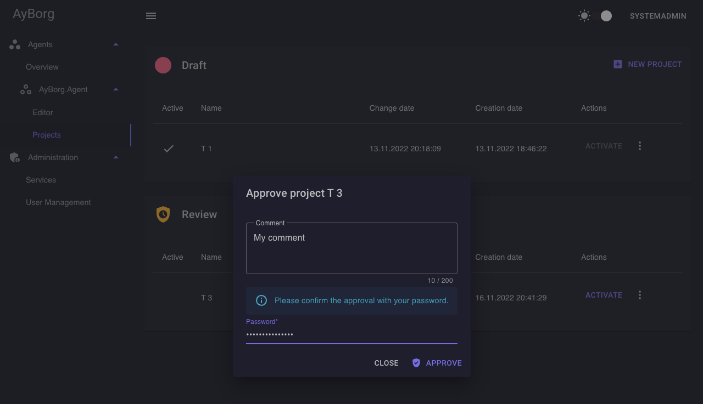
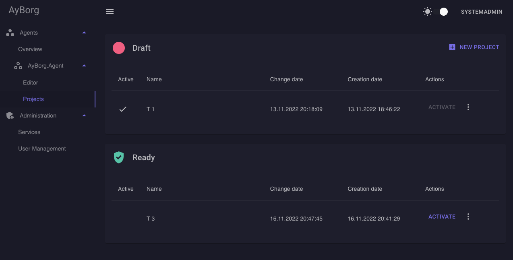

# Projects

The project page is splittet into multiple stages, while the path of state changes appears in following order:

Draft -> Review -> Ready

The project state can be changed from "Ready" back to "Draft", for example if a critical failure in the project setup is found. In this case, the project need to be approved again.

## Draft

Initialy a project will be saved as draft. While in this stage, the user can make changes without any need of approval. Also while in draft stage, no new version will be created.

## Create review

Click on 'Create review' and follow the steps to move the project into review state.

## Review

The project is in pending state, a approval from a second user with the right to approve is needed.
The version of the project should be increased.

## Abandon / Approve a review

Everyone with at least 'engineer' rights can always abandon a review.
For approve the review, you need 'reviewer' rights.

You need to enter your password to confirm the approval.

## Ready

The project is ready and approved.

> While the "Draft" project table is always visible, the tables for "Waiting for approval" and "Ready" are only displayed if a project with the according state exists.
